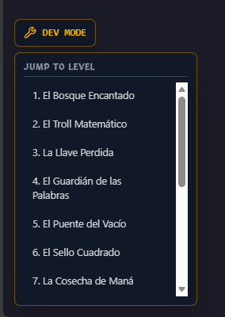

# 🧙‍♂️ PyDungeon: WebAssembly Game Engine


------------------------------------------------------------------------

## 🎮 Overview

**PyDungeon** es una plataforma educativa interactiva que ejecuta un
intérprete completo de Python directamente en el navegador mediante
WebAssembly.

Gamifica el aprendizaje de lógica de programación a través de un RPG de
exploración.\
A diferencia de validadores tradicionales, no requiere backend para
ejecutar código: todo ocurre en el cliente de forma segura y reactiva.

------------------------------------------------------------------------

## 🏗️ Arquitectura y Desafíos Técnicos

### 1️⃣ Ejecución de Código en el Cliente (Serverless Python)

Integración de **Pyodide (CPython compilado a WebAssembly)** para
ejecutar Python real dentro del navegador.

**Desafío técnico:**

-   Evitar bloquear el Main Thread con loops infinitos o cálculos
    pesados.

**Solución implementada:**

-   Control de flujo asíncrono.
-   Sandboxing.
-   Gestión segura de ejecución.

------------------------------------------------------------------------

### 2️⃣ Game Loop Reactivo de Alto Rendimiento

El motor NO utiliza Canvas tradicional.

Se basa en una grilla reactiva optimizada.

Optimizaciones:

-   Zustand para estado atómico.
-   Batch updates.
-   Minimización de re-renderizados.
-   Simulación fluida cercana a 60 FPS.

------------------------------------------------------------------------

### 3️⃣ Sistema de Archivos Virtual (VFS)

Editor basado en CodeMirror 6 que simula un entorno real.

API dinámica inyectada:

``` python
hero.move()
hero.attack()
```

------------------------------------------------------------------------

## ✨ Características del Proyecto

### ⚔️ Gameplay & Progresión Lógica


-   Variables
-   Condicionales
-   Bucles
-   Algoritmos básicos
-   Pensamiento computacional aplicado

------------------------------------------------------------------------

### 📜 El Grimorio (Scaffolding Educativo)


Sistema interactivo que guía sin revelar soluciones completas.

------------------------------------------------------------------------

### 🛠️ Developer Mode & Debugging



Herramientas avanzadas:

-   Visualización de colisiones
-   Coordenadas en tiempo real
-   Estados internos del motor

------------------------------------------------------------------------

## 🚀 Instalación Local

Proyecto basado en **Vite**.

``` bash
# 1. Clonar repositorio
git clone https://github.com/TiagoFrencia/PyDungeon.git

# 2. Instalar dependencias
cd PyDungeon
npm install

# 3. Ejecutar entorno dev
npm run dev
```

------------------------------------------------------------------------

## 📂 Estructura del Código

    src/hooks/usePyodide.ts        → Core del engine WASM + Python
    src/store/useGameStore.ts      → Estado global y sincronización UI
    src/components/MagicCanvas.tsx → Renderizado reactivo optimizado

------------------------------------------------------------------------

## 🧠 Engineering Decisions

-   Arquitectura client-first para eliminar dependencia backend.
-   WebAssembly para ejecutar Python real.
-   Estado desacoplado mediante Zustand.
-   Sistema modular orientado a extensibilidad.

------------------------------------------------------------------------

## 👨‍💻 Autor

**\[Tiago Frencia\] --- Full Stack Developer**

*"Construyendo puentes entre educación y tecnología moderna."*

------------------------------------------------------------------------
